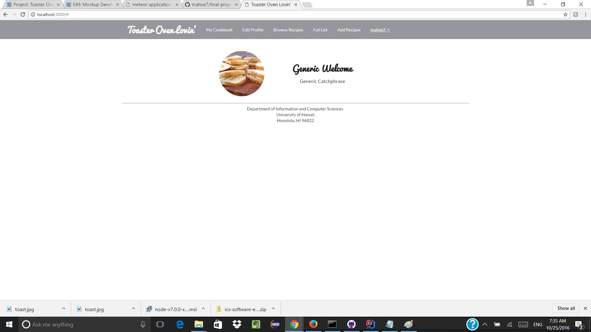
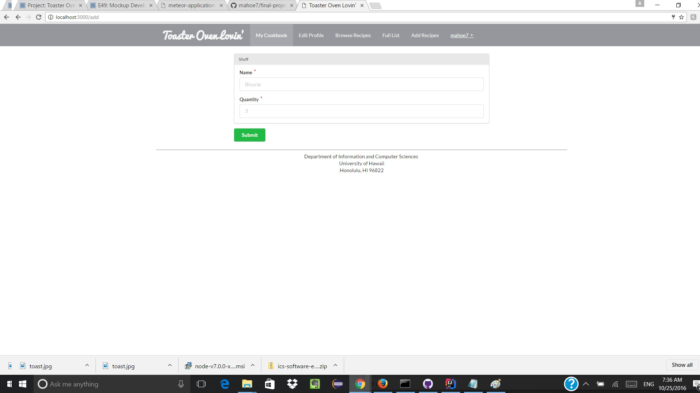
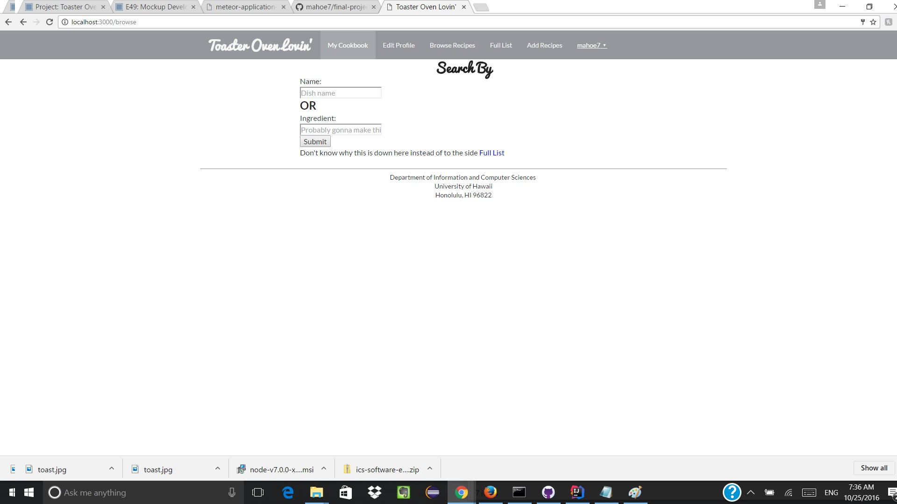
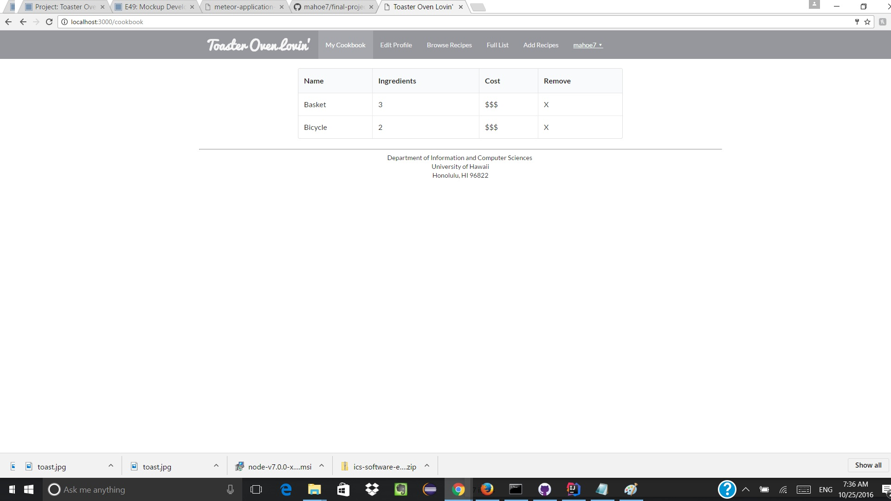

### Introduction

Toaster Oven Lovin' is a website meant to help poor college kids save some money while remaining alive! The picture above is what the website looks like to visitors who do not have an account or have not logged in yet.

### Logging In

Users can quickly log in at the top. If they do not have an account, they can quickly create one in only a few seconds. Screenshot is the home page after the user logs in. Not much change but I have not yet decided how I want to format it.

### Adding Recipes

Users can submit recipes to the website by filling out a quick form! Default placeholders are still in there because I have not yet meddled with the default database.

### Searching for Recipes

Users can search for recipes either through a master list (not yet implemented) or through keywords.

### Favorite Recipes

Users can also store and review which recipes they submitted and which recipes they really love!